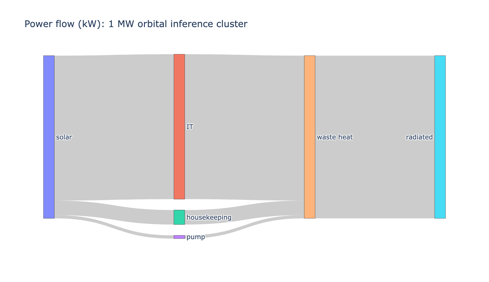
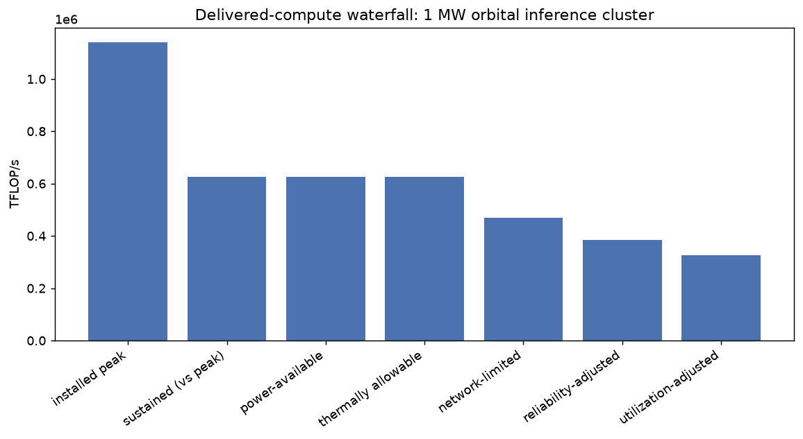
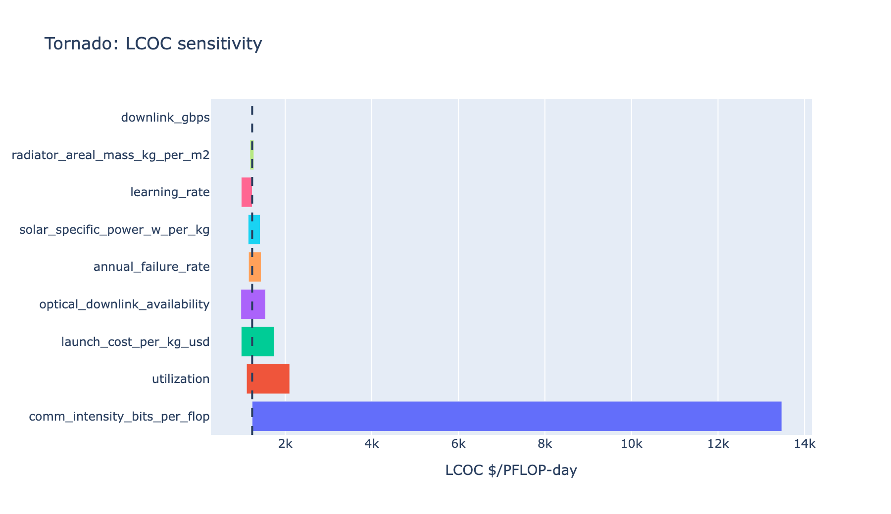
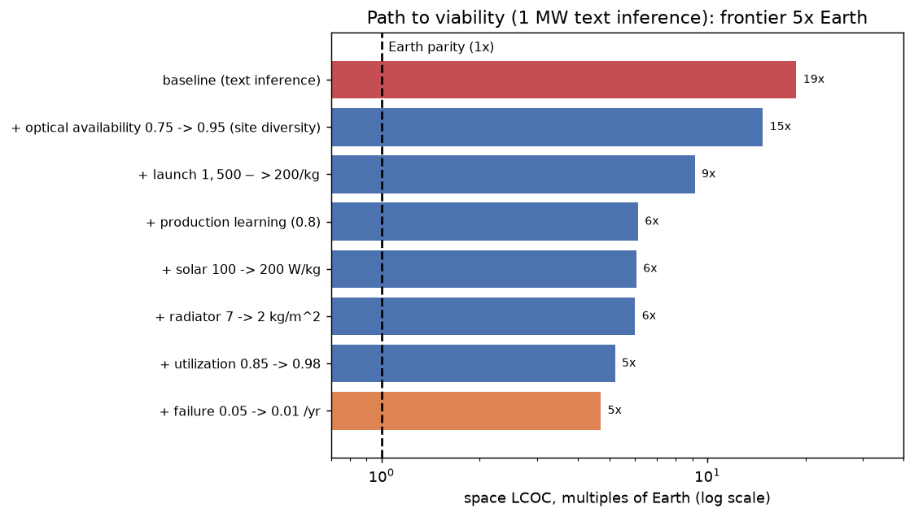
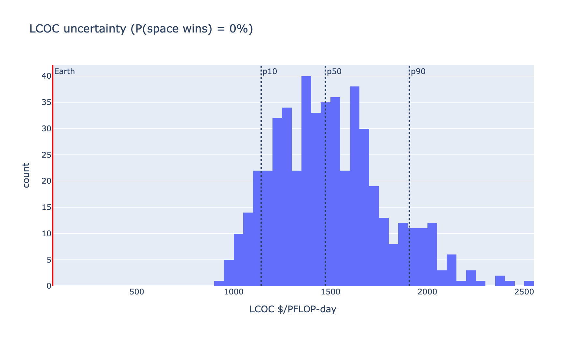

# Orbital data centers, by the numbers

A primer on space-based AI data centers and the technical and economic metrics
that decide their feasibility. It is built on Google's "Project Suncatcher" paper
([arXiv:2511.19468](https://arxiv.org/abs/2511.19468), Nov 2025) and made
reproducible with the `spacedc-mdao` package: every figure and number below comes
from a model you can run yourself. Where sources disagree, both the optimistic and
the conservative case are shown.

A note on scope: the comparison is for a 1 MW-class design against a hyperscale
terrestrial baseline (PUE 1.10). Numbers are illustrative of the *method*, not a
verdict on any specific company's hardware.

[Download as PDF](assets/orbital-data-centers-primer.pdf)

## Why orbit, why now

Building terrestrial data centers is getting harder. Of the global capacity due
online in 2026, 30-50% could be delayed (Sightline Climate, via the Economist,
Mar 2026), driven by permitting, grid connections, public opposition, and soaring
electricity demand. Orbit sidesteps some of this: a panel in a sun-synchronous
orbit sees nearly continuous sunlight and collects on the order of 8x the annual
energy of a mid-latitude panel on the ground (Suncatcher).

The Suncatcher moonshot is a constellation of solar-powered satellites carrying AI
accelerators, networked by free-space optical links. Google flew a single H100 in
LEO (Starcloud-1, Nov 2025) and Starcloud, SpaceX/xAI, and others are pursuing
variants. The question this primer addresses is not whether it is possible, but
which numbers have to hold for it to be economical.

## The architecture

The reference design (Suncatcher) is a fleet of small satellites, each with:

- **Solar arrays** sized for the accelerator load plus housekeeping, in a
  dawn-dusk sun-synchronous orbit (~650 km) that stays sunlit ~98% of the time.
- **AI accelerators** (TPUs or GPUs), radiation-tested for the mission dose.
  Suncatcher reports Trillium TPUs surviving a 5-year-equivalent total ionizing
  dose without permanent failures.
- **Free-space optical (FSO) inter-satellite links.** Bandwidth scales as 1/d², so
  the satellites fly in close formation (an 81-satellite, 1 km-radius cluster in
  the paper) to close a ~10 Tbps-per-link budget with commercial DWDM optics.
- **A thermal system** of heat pipes and radiators — the subsystem that most often
  decides whether the design closes (see below).
- **A ground link** for the fraction of work whose results return to Earth.



*Where the power goes: solar in, accelerators plus housekeeping plus coolant pump,
waste heat out through the radiator.*

## The governing idea: delivered compute, not nominal watts

A satellite's datasheet lists peak FLOP/s. What a data center sells is *delivered*
useful compute, which is the peak degraded by every real constraint:

```
C_delivered = C_peak · f_software · f_power · f_thermal · f_network · f_availability · f_utilization
```

Each factor is at most 1. A factor below 1 is compute thrown away by that
discipline. The product is usually far below 1, and the binding factor — the one
that fails first — is what to fix. For the bundled text-inference design, the
waterfall delivers about 29% of nominal; for a communication-heavy design, ~7%.



*Installed peak degraded to delivered compute. The cost that matters is dollars
per delivered PFLOP-day, not dollars per installed watt.*

## Key technical metrics

**Specific power (W/kg).** Processing watts per kilogram of satellite. It sets how
much compute each kilogram of launch buys. Starlink satellites are ~37 W/kg;
Starcloud targets ~70 W/kg; Musk has cited 100 W/kg, and ~150 W/kg is argued as a
future ceiling with better cells and flexible arrays. AI satellites can beat
Starlink because they skip the phased-array antennas and tight pointing Starlink
needs.

**Radiator areal mass (kg/kW) and flux (W/m²).** Heat can only leave a spacecraft
by radiation, which scales with area and the fourth power of temperature. A
radiator rejects on the order of 600 W/m² near room temperature (the model
reproduces Starcloud's ~633 W/m² figure from the net-flux balance), so a megawatt
of waste heat needs hundreds to thousands of square meters of deployable panel. In
the bundled design that is ~18 kg/kW of thermal hardware. Thermal closure is the
quiet failure mode: power closing does not imply heat can be rejected, and an
HBM-temperature limit can bind before the GPU's own junction limit.

**Communication intensity (bits/FLOP).** Bits that must leave the accelerator per
FLOP of compute. This is the single most decisive — and most uncertain — input.
Text inference is light: a token is ~32 bits and costs ~2·N_params FLOPs, giving
~1e-8 bits/FLOP. Returning embeddings, images, or other rich artifacts is ~1e-6 to
1e-5 — hundreds of times heavier. Whether the downlink binds depends entirely on
which regime the workload is in.



*Communication intensity dominates levelized-cost sensitivity, by far.*

**Crosslink bandwidth.** Inter-satellite optical links reach ~10 Tbps per aperture
in close formation; the model reproduces ~12.8 Tbps for the paper's 24-channel
DWDM, 10 cm aperture, 5 W terminal at 200 m separation. Crosslinks are cheap and
fast; the ground downlink is the bottleneck.

**Reliability and radiation (failure rate, TID).** Accelerators in orbit accrue
total ionizing dose and single-event upsets. Calculators assume 5-9% of GPUs fail
per year; Starcloud reports its flight unit did better than expected. Lower failure
rates mean fewer replacement launches.

**Orbit and eclipse.** A dawn-dusk sun-synchronous orbit keeps the array sunlit
~98% of the time, minimizing batteries, at the cost of fixed ground-pass geometry.

## Key economic metrics

**Launch cost ($/kg).** The dominant capital input. SpaceX quotes ~$1,500/kg
(Falcon Heavy) to ~$3,400/kg (Falcon 9) today; a learning-curve analysis in the
Suncatcher paper suggests ≤$200/kg to LEO by the mid-2030s if Starship becomes
fully reusable. Launch is also the lever the analysis and the optimists most agree
on.

**Satellite cost ($/W, GPUs excluded).** Dollars per processing watt for the bus,
solar, radiator, and comms. Starlink is ~$22/W (down from ~$32/W); Starcloud
claims under $5/W for an AI satellite that drops the communications hardware. This
is the assumption the conservative model does *not* reproduce — see below.

**Levelized cost of compute (LCOC, $/PFLOP-day).** Lifecycle cost divided by
*delivered* PFLOP-days. This is the honest headline because it charges for the
delivered-compute waterfall, not just the capacity built.

**Capacity capex ($/W of IT power, GPUs excluded).** Total build cost per watt,
the apples-to-apples figure for capex-style calculators. Useful because GPUs are
the same on Earth and in orbit, so they cancel.

**Learning curves (Wright's law).** Unit cost falls by a fixed fraction per
doubling of production. It is how launch reaches $200/kg and how a satellite line
reaches $5/W — real, but a projection, not a measurement.

## What would have to be true

Running the bundled 1 MW design against a hyperscale Earth baseline
(~$66/PFLOP-day, ~$12/W capacity capex):

| Design | LCOC | vs Earth | Binding constraint |
| --- | ---: | ---: | --- |
| Text inference | ~$1,237 | ~19x | optical-downlink availability + capex |
| Rich-output (multimodal) | ~$5,389 | ~82x | downlink bandwidth |
| McCalip-optimistic sliders | ~$428 | ~6x | residual capex + the waterfall |

Three findings hold up:

1. **The Earth number checks out.** Our terrestrial capacity capex (~$12/W ≈
   $12bn/GW) lands on McCalip's $15.9bn/GW estimate — a useful validation that the
   cost model is calibrated.
2. **Launch is the agreed-on lever.** Moving to the speculative $200/kg case drops
   launch from ~$236/W to ~$11/W, consistent with the optimists. Starship closing
   the launch gap is the load-bearing assumption everyone shares.
3. **Satellite cost is the open question.** Even with every optimistic slider, the
   satellite stays ~$200/W against Starcloud's claimed $5/W. That ~40x gap is
   dominated by the costed power system (solar at $50-60/W in the catalog), comms,
   and integration. Whether a $5/W AI satellite is buildable is where optimists and
   the conservative model part ways — see [vs the McCalip calculator](vs-mccalip.md).



*Stacking every optimistic lever on the text-inference design moves it from ~19x
to ~5x Earth, but not to parity — the delivered-compute waterfall and the residual
capex remain.*

The honest verdict: for a 1 MW text-inference workload, Earth wins on levelized
cost across the plausible range, and the package finds space beats Earth in 0% of
500 Monte-Carlo draws. The result is most sensitive to the workload's communication
intensity, the satellite cost, and the launch price — in that order. None of this
says orbital data centers are impossible; it says viability turns on a small,
identifiable set of numbers, and two of them (the $5/W satellite, the
near-zero-downlink workload) are not yet demonstrated.



*Levelized cost under input uncertainty: the conservative model never crosses the
Earth baseline for this workload.*

## Reproduce it yourself

Every number above is regenerable:

```bash
pip install spacedc-mdao

# the honest headline for text inference
orbitdc compare examples/scenarios/orbital_1mw_inference.yaml \
  examples/scenarios/earth_hyperscale_baseline.yaml --tornado

# the downlink-bound regime
orbitdc compare examples/scenarios/orbital_multimodal_inference.yaml \
  examples/scenarios/earth_hyperscale_baseline.yaml

# the McCalip-optimistic sliders
orbitdc compare examples/scenarios/orbital_mccalip_optimistic.yaml \
  examples/scenarios/earth_hyperscale_baseline.yaml
```

Change any assumption (launch $/kg, W/kg, $/W, bits/FLOP, failure rate) in the
scenario YAML or as a sensitivity sweep, and watch the binding constraint move. The
[quick start](quickstart.md), [model architecture](architecture.md), and
[governing equations](equations.md) pages go deeper; every default carries
provenance.

## References

- B. Agüera y Arcas et al., "Towards a future space-based, highly scalable AI
  infrastructure system design" (Project Suncatcher), arXiv:2511.19468, Nov 2025.
- The Economist, "Data centres in space: less crazy than you think," 2 Mar 2026.
- A. McCalip, orbital data center cost calculator, andrewmccalip.com.
- Starcloud, Starcloud-1 mission (H100 in LEO, Nov 2025).
- NASA/MIT Lincoln Laboratory, TBIRD 200 Gbps optical downlink demonstration, 2023.
- `spacedc-mdao`: <https://github.com/jman4162/spacedc-mdao> ·
  <https://pypi.org/project/spacedc-mdao/>
